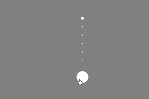

# 鼠标拖动效果组件
## 依赖
1. TweenMax.js  

## 效果



## 使用方法
```
    <script src="scrubber.js" ></script>
    <script>
    var a = new scrubber({
            el:,
            circle:,
            dot: ,
            distance: ,
            create: function () {},     
            update: function () {},
            end: function(){}
        })
        a.enable()
    <script/>
```


## 参数

| 参数名              | 值             | 回调函数参数(可选)                    |
| ---------------- | ------------- | ----------------------------- |
| el(组件挂载点)        | :elementNode  |                               |
| circle(跟随鼠标的控制点) | : cssSelector |                               |
| dot(过渡小点)        | :cssSelector  |                               |
| distance(小点间距)   | :int          |                               |
| create(创建钩子)     | :function     |                               |
| update(状态更新钩子)   | :function     | [x轴移动距离,y轴移动距离,x轴移动方向，y轴移动方向] |
| end(滑动结束钩子)      | :function     |                               |

## 方法

| 方法名     | 用途          | 参数   |
| ------- | ----------- | ---- |
| init    | 初始化组件状态     |      |
| enable  | 开启组件，添加拖动效果 |      |
| disable | 关闭组件        |      |